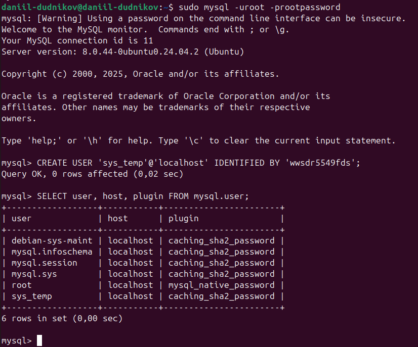
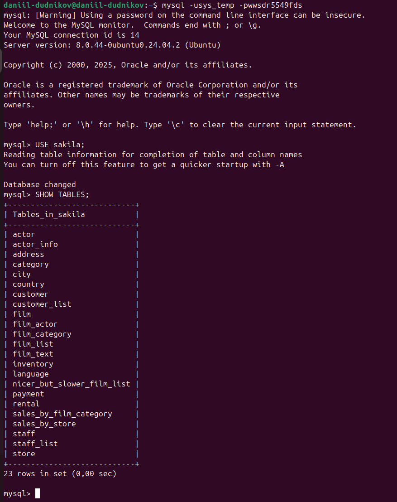
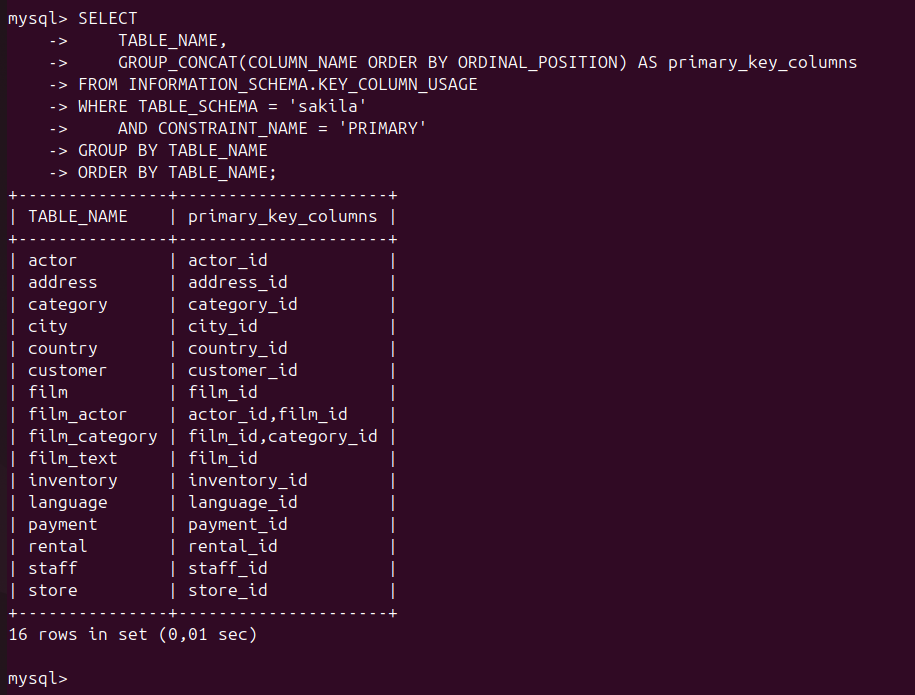
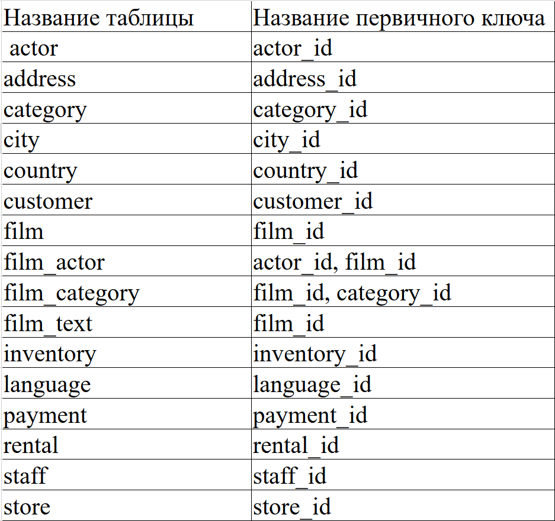
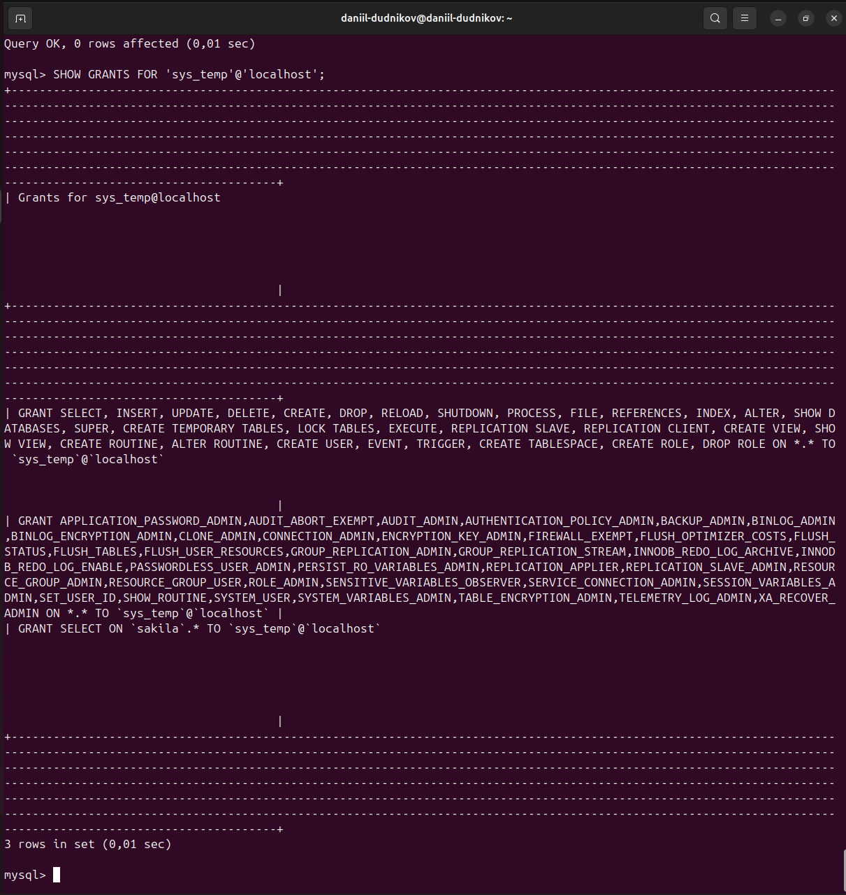

# Домашнее задание к занятию «Работа с данными (DDL/DML)»
## Выполнил: Даниил Дудников

## Задание 1

### 1.1-1.3. Создание пользователя sys_temp
Создание новой учетной записи в MySQL с последующей проверкой ее наличия в системной таблице пользователей.

### 1.4-1.5. Права пользователя sys_temp  
Предоставление полных привилегий пользователю sys_temp и подтверждение успешного применения разрешений.

### 1.6-1.8. Восстановление базы sakila
Загрузка, восстановление и проверка структуры демонстрационной базы данных sakila от MySQL.

## Задание 2

### 2.1-2.3. Анализ структуры базы данных
Определение первичных ключей всех таблиц базы sakila с использованием системного каталога INFORMATION_SCHEMA.

### Результат запроса первичных ключей:

### Таблица в Markdown формате:

### Таблица первичных ключей:

| Название таблицы | Название первичного ключа |
|------------------|---------------------------|
| actor            | actor_id                  |
| address          | address_id                |
| category         | category_id               |
| city             | city_id                   |
| country          | country_id                |
| customer         | customer_id               |
| film             | film_id                   |
| film_actor       | actor_id, film_id         |
| film_category    | film_id, category_id      |
| film_text        | film_id                   |
| inventory        | inventory_id              |
| language         | language_id               |
| payment          | payment_id                |
| rental           | rental_id                 |
| staff            | staff_id                  |
| store            | store_id                  |
|------------------|---------------------------|

## Задание 3*

### 3.1-3.2. Тонкая настройка прав доступа
Точечное ограничение прав пользователя sys_temp: отзыв прав на модификацию данных при сохранении прав на чтение в базе sakila.

### 3.2. Права пользователя sys_temp после отзыва прав

